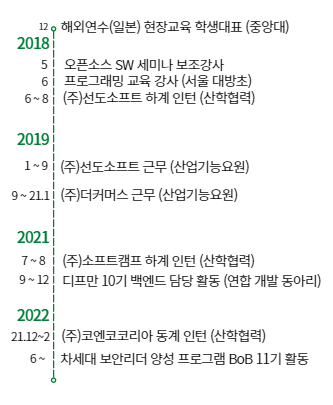
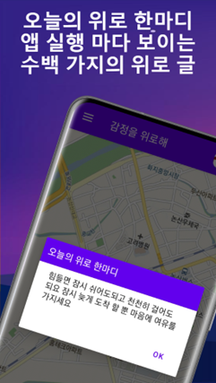
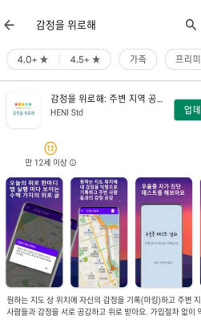
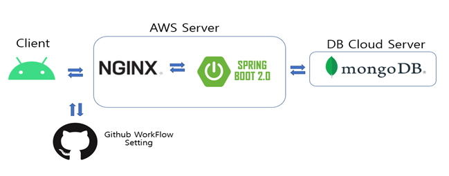

# 이해인 (Haein Lee)

**Backend Developer**
##### **깃허브(Github) [https://github.com/2haein](https://github.com/2haein)**
##### **📃 [https://developier.com](https://developier.com)**&nbsp;&nbsp; &nbsp; &nbsp;   **📃 [https://zerocodings.com](https://zerocodings.com)**
##### **🎂 1996.08.16**&nbsp; &nbsp; &nbsp; &nbsp;  **📱 010-xxxx-xxxx** &nbsp;&nbsp;&nbsp;&nbsp;**📩 eehaein2@gmail.com** &nbsp; &nbsp;&nbsp;&nbsp; **🏠 서울 강남구**

---

#### **안녕하세요. IT 서비스를 만드는 이해인입니다.**

2년차 개발자로 온라인 E-Commerce 스타트업에서 개발자로 커리어를 시작하여 베타버전때부터 서비스 출시를 함께하여 개발 전과정의 Process에 대한 이해도를 높였고 현재 백엔드 Server 개발에 정진하고 있습니다.

---
## **Profile**

---

### **학력**

**중앙대학교(서울) (Chung-Ang University)**

- 컴퓨터공학부 전공 (Computer Science and Engineering)
- 2017.03 - 2023.02
- GPA ( 3.94 / 4.5 )

### **교육 이력**

- **차세대 보안리더 양성 프로그램 (BoB 11기)**
- 오픈소스 GIS 개발자 심화과정 수료 (LX한국국토정보공사)
    

### **수상 내역**

- 중앙대 전공과목 “프로그래밍”에서 우수 성적 장학금 수상(2017-2)
- (중앙대 교내 수상) 중앙대학교 SW교육봉사단 상

### **활동**

### **외국어**

TOEIC 2020.9.13 (ETS기관)

### **기타**

한자능력검정3급 취득 (대한검정회)

해외유학생 영어안내역할 수행(중앙대 Ambassador)

 

---
## **경력**

---

### **㈜ 더커머스 2019.09.23 ~ 2021.01.02 (산업기능요원)**

- **온라인 이커머스 플랫폼 개발 ([www.onesell.co.kr](https://www.onesell.co.kr), [m.onesell.co.kr](http://m.onesell.co.kr))**

플랫폼 개발 및 배포를 시작으로 서비스 각종 기능 개발, 확장 및 테스트, 모바일 반응형 웹 개발작업 진행, 베타 서버때부터 개발 전과정의 출시를 함께함 

  작업한 개발 내역

대시보드 작업현황, 문의관리, 공지사항, 쇼핑몰 공지사항, 어드민 공지사항 관리, 1:1 문의내역, 쇼핑몰 문의내역, (사업자, 개인사업자 구분) 회원가입 구현, 쇼핑몰 계정관리, 상품관리 테이블 적용, 상품등록 및 쇼핑몰로 상품등록내용 전송 기능 구현(인터파크, 옥션, Gmarket 연동 추가), 모바일 반응형 웹 개발

  사용한 Tool 및 Skill

`SpringBoot, Vue, Angular(약간), HTML, Css3, Webpack, Mysql, Nosql(Mongo)`

`Git(BitBucket), Robo3T, NoSqlBooster, Jira(Agile 일주일 작업 단위 관리), Confluence(개발 내용 문서화)`  

### **㈜ 선도소프트 2019.01.02 ~ 2019.09.21 (산업기능요원)**

- **유해대기오염 실시간 3D 공간분포 매핑기술 및 관리 프로그램** **개발 - (국)표준과학연구원** **수주**

Web + Mobile(안드로이드) 개발 및 연동

시각적으로 보여주기위해 지도위에 오염분포도를 매핑(Cesium Javascript 라이브러리 사용)

실시간으로 전송되는 웹과 모바일을 통한 푸시알람 구현 (대기오염농도 일정수치 초과할 시)

주변 오염수치를 계산하는 알고리즘은 보간법(InterPolation)분석을 이용하여 알고리즘을 넣어 좌표사이의 빈공간 오염수치를 분석하여 측정

`Spring(Java, Jsp, Mybatis, Js, Css), Python, PostgreSql, Mysql, Android(Java)`

- **부동산 FORUM WEB Program 개발 – 사단법인 한국부동산금융투자포럼에서 의뢰**

접근 가능한 URL도메인을 통하여 접속 가능한 홈페이지 및 기반 시스템 구축

홈페이지는 회원 등록/관리/조회 등 회원관리에 대한 전반적인 기능 수행

게시판 형태의 페이지를 통하여 사용자에게 관리자가 게시물 열람 가능 기능 추가

`Spring5(Java, Jsp, Mybatis, Js, Css), Oracle`

- **빅데이터 모델개발 (R 프로그래밍 활용) 데이터 정제분석**

빅데이터에서 필요한 데이터를 추출하여 테이블 형식으로 재가공

`R`  

 

---
## **인턴 경력**

---

### **㈜ 코엔코코리아 2021.12.22 ~ 2022.02.28 (산학협력 동계 인턴)**

- **가상자산거래소 플랫폼 웹 서버 개발**
1. 기존에 있던 레거시 프로젝트의 관리자 테이블 형식이 클라이언트 사이드 렌더링 방식을 서버 사이드 렌더링 방식으로 변경 (다른 게시글 테이블에서도 유지보수가 용이하도록 공통으로 적용될 수 있는 로직을 개발) 게시글이 만건이 넘어가게 될 경우 렌더링 되는 속도가 현저히 느려지고 이런 방식은 추후 서비스가 점차 확장될 경우 문제가 커질 수 있으므로, 해당 방식으로 교체한 후, 게시글이 얼마나 있든 사용자에게 보여지는 페이지당 존재하는 게시글의 수만 서버에서 불러오면 되므로 렌더링 속도가 눈에 띄게 현저히 빨라지도록 개선함
2. 가입 프로세스 내의 이메일을 통해 인증 기능 추가, AML 작업 (불량 사용자 분류 작업)

`Spring(Java, Servlet, Mybatis, Mysql)`

### **㈜ 소프트캠프 2021.07.15 ~ 2021.08.31 (산학협력 하계 인턴)**

- 원격 접속 재택근무 프로그램 개발 (Shield@Home 서버)

RDP 프로토콜을 이용한 원격 접속 프로그램으로 사용자가 사내망의 컴퓨터에 원격접속이 안되는 오류가 존재해 해당 오류를 수정하고 프로세스를 개선. 그외에 실제 서비스중인 프로그램으로 사용자와의 소통을 통해 잔존해있는 오류들을 수정

`Spring , C++(Socket), XMPP protocol`

### **㈜ 선도소프트 2018.06.25 ~ 2018.08.24 (산학협력 하계 인턴)**

- **(국가 기후변화적응센터) 웹 개발 프로그래밍**
- **유해대기오염 실시간 3D 공간분포 매핑 (Android, App)**

(국)표준과학연구원에서 수주받은 프로젝트로 산업단지내의 유해대기오염을 시각적으로 보여주기위한 오염분포를 보여주기위해 모바일 어플리케이션으로 개발을 진행
해당 오염수치가 일정수치 이상일 경우에 웹과 연동된 모바일 어플을 통해 경고알람을 표출  

`Android(Java), Spring(Java, JavaScript, Css)`  

---
## **자기계발**

---

### **BoB(차세대 보안리더 양성 프로그램) 11기 (2022.06 ~ )**

### **디프만(Depromeet) 10기 (2021.09 ~ 2021.12)**

- Backend 개발 (Spring Boot),
- 위치 기반 베이커리 서비스 (신규 빵집 가게 위치 연동 및 메뉴 등록, DB 스키마 구성)

  👉[프로젝트 성과 링크](https://depromeet.com/project/21)  

 

---
## **Project**

---

### **감정을 위로해 - SW 중심대학 중앙대 캡스톤 프로젝트 (1)**

자신의 감정을 기록하고 자신의 위치를 이용해 주변 지역 사람들과 감정을 공유하여 서로 공감하고 위로받을 수 있는 앱 기반의 플랫폼 서비스입니다.

**기술스택** | Android(Java), SpringBoot, MongoDB(NoSQL DB), AWS Cloud, Github

  
  
  
### **우리아이 심부름을 부탁해 - SW 중심대학 중앙대 캡스톤 프로젝트 (2)**

아이가 심부름을 나갈 때 부모님들의 걱정은 다양합니다. 본 서비스에서 고려한 위험 요소들은 다음과 같습니다. 정부에서 제공하는 공공데이터 api와 시민들의 위험요소 신고로 이루어져 정부에서 제공하는 데이터를 점차 확대해 나가 시민들이 모두 함께 참여하는 공공데이터로 확장할 수 있습니다.

본 서비스의 주요 기능은 4가지로 요약할 수 있습니다. 첫째 심부름을 보내는 것을 기록하기, 둘째 심부름 보낼 때 자동으로 퀘스트 부여하기, 셋째 위험요소를 제외한 아이의 심부름 경로 추천하기, 마지막으로 시민들이 위험 지역을 신고하여 같이 만드는 안전지도입니다. 이러한 기능을 바탕으로 부모/시민 모드와 아이 모드를 하나의 앱으로 구현하였습니다.

**기술스택** | Android(Java), SpringBoot, MongoDB(NoSQL DB), AWS Cloud, Github

👉[프로젝트 성과 링크](https://www.swaicau.com/bbs/board.php?bo_table=program8&wr_id=&wr_id=147)  

---
## **Tech Skills**

---

- Java(Spring, Android)

- JavaScript(Vue), Css3

- Python

- AWS (EC2/S3/Route53)

- Docker

- C, C++

**Tools**

- Git

- Jira/Conflunce  

---
#### **소개**

---

### **E-Commerce 스타트업 개발업무를 통한 실무경험소유**

가장 큰 성과로 생각하는 건 산업기능요원으로 전자상거래를 서비스하는 E-Commerce회사에서 1~2년간의 실무경험을 갖고 있다는 점입니다. 이 경험을 통해 현재 실질적으로 중요시되는 트렌디한 개발 기술을 접하였고 실제로 우리 서비스를 사용하는 5천명의 사용자들에게 서비스할 필요한 업무들을 개발하였습니다. (E-Commerce의 상품, 주문, 정산, 문의쪽 로직 및 상품등록 및 쇼핑몰 상품등록시에 설정해야하는 옵션을 MongoDB를 통해 구조들을 연계해서 작업을 하였습니다)

제가 근무했던 곳은 인력도 소규모이고 제가 책임지고 맡아야 할 업무가 많고 실시간으로 버그가 발생하면 즉각적으로 수정하고 위기에 대처하는 능력도 많이 키우게 된 것 같습니다. 그 외에 해킹위험에 따른 보안적인 기술을 접목할 만한 개발 경험들을 쌓았고 저한테 좋은 밑바탕이 된 것 같습니다. 하나의 서비스를 출시하기 위해 소수의 개발자 인원들과 함께 Git을 통해 프로젝트 작업들을 공동으로 협업해왔기 때문에 의사소통하는 것을 중요시 여긴다는 장점이 있습니다.

스타트업의 근무 경험을 통해서 하나의 서비스가 프로젝트 생성부터 시작해서 하나의 서비스를 출시하기 까지의 프로세스를 전부 경험해보았고 함께 해왔습니다. 경력 있는 신입으로서 제 자신의 개발 프로젝트이라는 마음가짐으로 열심히 하겠습니다.

### **가치관 및 성격과 강점**

안녕하세요, 일단 제 가치관을 얘기하자면 저의 가치관은 “현실에 안주하는 것이야 말로 인생의 독이다.” 로 정리할 수 있을 것 같습니다.

하루 공부가 인생에 있어서 크지 않을 수는 있지만, 그 하루가 없으면 그 다음날의 조금 더 성장한 나를 보지 못할 것이고 그런 날이 많아지면, 인생의 성장속도는 더디어지게 된다고 생각합니다 항상 그런 안주함을 방지하고자 나날이 자기개발에 힘씁니다. 매일같이 새로운 개발 기술들이 나오는 IT문화와 잘 융합된다고 생각합니다. 개발자로써 항상 끊임없이 배우고 새로운 기술을 적용하는 것을 무척 좋아합니다.

### **업무 중 난관에 대처하는 방법?**

E-Commerce 서비스 플랫폼을 시작부터 출시까지 하면서 당연히 난관도 있었습니다. 10월에 프로젝트를 시작하였는데 회사내에 적은 예산으로 인해 빠르게 서비스를 출시해야 하는 상황이었습니다. 4개월만에 완성을 해서 어느정도 돌아가는 서비스를 출시를 해야 했습니다. 짧은 기간으로 만드는 와중에 완성도를 높이기 위해 하나의 기능을 완성과 동시에 모든 가능한 기능 테스트를 계속 동시에 같이했습니다. 그러다 보니 버그가 걸리는 부분(상품등록 및 전송 몇 가지 값이 전송이 안되는 부분)을 서비스 출시 전에 찾아낼 수 있었습니다. 결국엔 완성도 있는 서비스를 개발하는데 성공하였는데 무엇보다 완성도 있는 서비스를 개발하는데 성공을 하기 위해선 팀원들과의 효율적인 업무배분을 위해 팀내에서 의사소통을 끊임없이 하고 팀원과의 서로만의 어려운 부분에 대한 공감이 중요했던 것 같습니다.