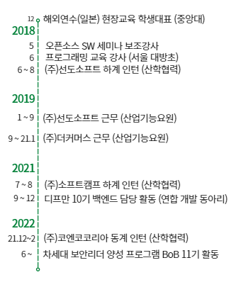
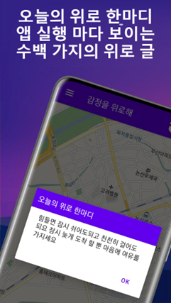
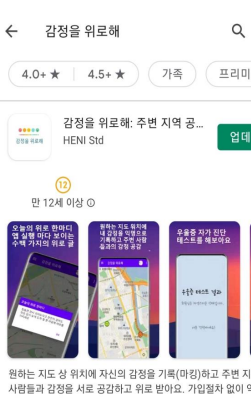
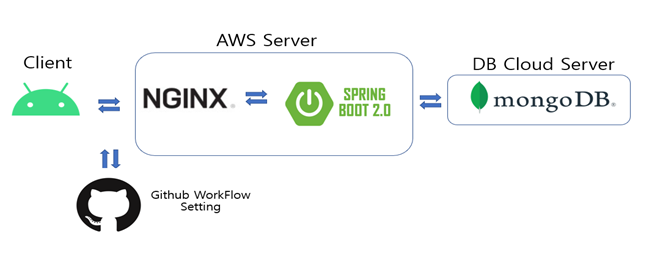
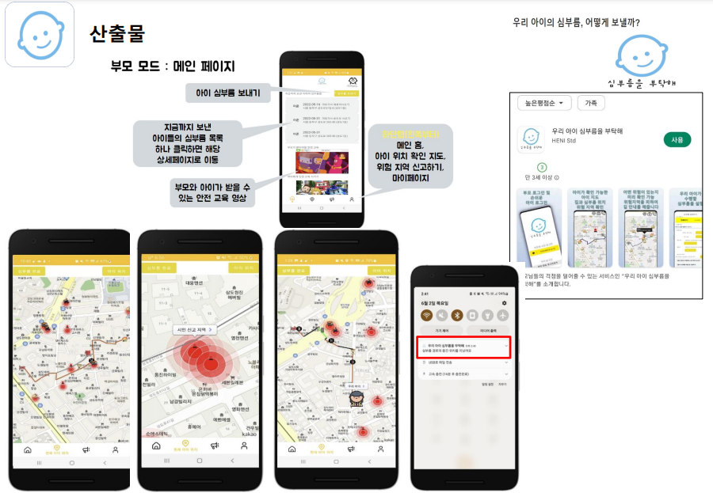

# 이해인 (Haein Lee)

**Backend Developer**
##### **깃허브(Github) [https://github.com/2haein](https://github.com/2haein)**
##### **📃 [https://developier.com](https://developier.com)**&nbsp;&nbsp; &nbsp; &nbsp;   
##### **📃 [https://zerocodings.com](https://zerocodings.com)**
##### **🎂 1996.08.16**&nbsp; &nbsp; &nbsp; &nbsp;  **📱 010-xxxx-xxxx** &nbsp;&nbsp;&nbsp;&nbsp;**📩 eehaein2@gmail.com** &nbsp; &nbsp;&nbsp;&nbsp; **🏠 서울 강남구**

---

#### **안녕하세요. IT 서비스를 만드는 컴퓨터공학을 전공한 개발자 이해인입니다.**

IT 분야 전문성을 키우기 위해 재학시절 산업기능요원으로 디지털 커머스 스타트업에서 개발자로 커리어를 시작하며 창립 단계부터 참여하여 서비스 네이밍과 기획, 개발 전 과정을 함께 진행했습니다.
하나의 서비스를 프로젝트 생성부터 시작해서 서비스를 출시하기까지의 전반적인 개발 Process를 경험하며 개발 전과정에 대한 이해도를 높였습니다.

현재 Server 개발에 정진하고 있습니다.

---
## **Profile**

---

### **학력**

**중앙대학교(서울) (Chung-Ang University)**

- 컴퓨터공학부 전공 (Computer Science and Engineering)
- 2017.03 - 2023.02 (졸업)
- GPA ( 3.94 / 4.5 ) - Major ( 4.01 / 4.5 )
- 총 이수학점 (147학점)

### **교육 이력**

- **차세대 보안리더 양성 프로그램 (BoB 11기)**
- 오픈소스 GIS 개발자 심화과정 수료 (LX한국국토정보공사)
    

### **수상 내역**

- 중앙대 전공과목 “프로그래밍”에서 우수 성적 장학금 수상(2017-2)
- (중앙대 교내 수상) 중앙대학교 SW교육봉사단 상

### **대학 교외 활동**

### **외국어**

TOEIC 830 (2026.04.26 ETS기관 102715)

TOEIC SPEAKING IH 150 (2026.03.14 ETS기관)

### **기타**

한자능력검정3급 취득 (대한검정회)

해외유학생 영어안내역할 수행(중앙대 Ambassador)

정보처리기사 (2023.06.09 취득) (한국산업인력공단 / 23201070944K)

SQLD 자격증 (2023.12.15 취득) (한국데이터산업진흥원 / SQLD-051001201)

ADsP 자격증 (2024.03.22 취득) (한국데이터산업진흥원 / ADsP-040008683)

병역사항 (2019.01.08 ~ 2021.01.02)

 

---
## **경력**

---

### **㈜ 코스콤(한국증권전산) 2023.07.17 ~ 현재 (서버 개발자)**

- **증권사 플랫폼 서버 개발 및 WEB & APP(iOS, AOS) 개발을 담당하고 CI/CD 자동화 파이프라인 구축 및 개선**

국내 및 해외 증권사 플랫폼 서버 개발 (C, Spring Boot)

WEB과 APP 개발 및 배포, 운영 관리 (Java, Obj-C, Javascript, React)

JENKINS를 통한 웹 및 앱 CI/CD 배포 자동화 PipeLine 개발 및 소나큐브(SonarQube) 도입 후 PipeLine 내 코드 정적 분석 자동화 연동

배포 Pipeline 내 깃훅 설정을 통해 풀 리퀘스트 자동 검증 및 수정된 코드 파일 내 컨벤션 룰 검증 설정 개발 
(대규모 프로젝트 개발의 통합품질관리를 위한 신규 파일에 대한 주석 포맷 및 커밋 형식 검증)

- **대규모 금융 클라우드 이관 및 DB 마이그레이션 수행**

국내외 증권사 플랫폼 내 다수의 가동 중인 서비스 서버 및 데이터베이스 전면 클라우드 마이그레이션

이관 과정 중 서비스 중단 최소화를 위한 Active-Active 방식의 이중화 아키텍처를 구성하여 서비스 중단(Zero-Downtime) 없는 무장애 DB 마이그레이션 및 데이터 신뢰성 검증 수행

- **디지털브랜치 개발 및 운영**

국내외 증권사들의 PPR 전자서식 프로그램 개발 및 운영

- **인터페이스 송수신 FEP 대외계 운영 및 개발**

국내 및 해외 증권사들(kse, ksq, knx 주문, 체결, 파생) 대외계 시스템 운영 및 개발

대외기관(한국은행, 금결원, 예탁원 등) 대외계 시스템 운영 및 개발, 금융결제원 지급결제 시스템 개발

-  **사용한 Tool 및 Skill**

`C, C++, Socket, Oracle DB`

`Git`

### **㈜ 신한카드 2023.01.01 ~ 2023.07.17 (공채 입사 서버 개발자)**

- **신한pLay 서버 개발**

신한pLay 앱 서비스 서버 플랫폼 개발 및 운영

-  **작업한 개발 내역**

Union Pay Interface 설계 및 개발 및 pLay 대시보드 모니터링 시스템 구축 (모니터링 UI 화면 및 배치서버 개발)을 통한 Slack 도입 및 Slack을 통한 결제 오류 알람 실시간 전송

- **상세 개발 내역 (Slack 알람 송출 서비스)**

**일정 시간 사용자 통계 값(회원가입, 로그인, 온/오프 결제 금액, 생체인증FIDO, 터치결제 등)의 변화가 없을 시 SLACK을 통해 알람 송출**

Redis에 이틀간의 데이터만 적재하고(메모리 절감상) 실시간으로 데이터를 빠른 속도로 호출하고 이전 데이터는 DB에 저장하여 히스트뢰 관리. 24시간 배치서버를 가동해 일정시간 별 확인을 통해 오류가 발생 시 슬랙으로 알람 송출. 도입안 제시를 통해 정보보호부에 건의를 통해 처음으로 회사 내 실무적으로 Slack 서비스 도입하여 자체 개발.

-  **사용한 Tool 및 Skill**

`SpringBoot, Spring, JavaScript, Redis, Oracle DB`

`Git`

### **㈜ 더커머스 2019.09.23 ~ 2021.01.02 (산업기능요원)**

- **온라인 이커머스 플랫폼 개발 ([www.onesell.co.kr](https://www.onesell.co.kr), [m.onesell.co.kr](http://m.onesell.co.kr))**

플랫폼 개발 및 배포를 시작으로 서비스 각종 기능 개발, 확장 및 테스트, 모바일 반응형 웹 개발작업 진행, 베타 서버때부터 개발 전과정의 출시를 함께함 

-  **작업한 개발 내역**

대시보드 작업현황, 문의관리, 공지사항, 쇼핑몰 공지사항, 어드민 공지사항 관리, 1:1 문의내역, 쇼핑몰 문의내역, (사업자, 개인사업자 구분) 회원가입 구현, 쇼핑몰 계정관리, 상품관리 테이블 적용, 상품등록 및 쇼핑몰로 상품등록내용 전송 기능 구현(인터파크, 옥션, Gmarket 연동 추가), 모바일 반응형 웹 개발

-  **사용한 Tool 및 Skill**

`SpringBoot, Vue, Angular(약간), HTML, Css3, Webpack, Mysql, Nosql(Mongo)`

`Git(BitBucket), Robo3T, NoSqlBooster, Jira(Agile 일주일 작업 단위 관리), Confluence(개발 내용 문서화)`  

### **㈜ 선도소프트 2019.01.02 ~ 2019.09.21 (산업기능요원)**

- **유해대기오염 실시간 3D 공간분포 매핑기술 및 관리 프로그램** **개발 - (국)표준과학연구원** **수주**

Web + 모바일(AOS) 개발 및 연동

시각적으로 보여주기위해 지도위에 오염분포도를 매핑(Cesium Javascript 라이브러리 사용)

실시간으로 전송되는 웹과 모바일을 통한 푸시알람 구현 (대기오염농도 일정수치 초과할 시)

주변 오염수치를 계산하는 알고리즘은 보간법(InterPolation)분석을 이용하여 알고리즘을 넣어 좌표사이의 빈공간 오염수치를 분석하여 측정

`Spring(Java, Jsp, Mybatis, Js, Css), Python, PostgreSql, Mysql, Android(Java)`

- **부동산 FORUM WEB Program 개발 – 사단법인 한국부동산금융투자포럼에서 의뢰**

접근 가능한 URL도메인을 통하여 접속 가능한 홈페이지 및 기반 시스템 구축

홈페이지는 회원 등록/관리/조회 등 회원관리에 대한 전반적인 기능 수행

게시판 형태의 페이지를 통하여 사용자에게 관리자가 게시물 열람 가능 기능 추가

`Spring5(Java, Jsp, Mybatis, Js, Css), Oracle`

- **빅데이터 모델개발 (R 프로그래밍 활용) 데이터 정제분석**

빅데이터에서 필요한 데이터를 추출하여 테이블 형식으로 재가공

`R`  

 

---
## **인턴 경력**

---

### **㈜ 신한캐피탈 2022.11.01 ~ 2022.12.01 (ICT부 인턴)**

- **계정계 시스템 및 서버 개발**

`Spring(Java, Oracle)`

### **㈜ 코엔코코리아 2021.12.22 ~ 2022.02.28 (산학협력 동계 인턴)**

- **가상자산거래소 플랫폼 웹 서버 개발**

기존에 있던 레거시 프로젝트의 관리자 테이블 형식이 클라이언트 사이드 렌더링 방식을 서버 사이드 렌더링 방식으로 변경 (다른 게시글 테이블에서도 유지보수가 용이하도록 공통으로 적용될 수 있는 로직을 개발) 게시글이 만건이 넘어가게 될 경우 렌더링 되는 속도가 현저히 느려지고 이런 방식은 추후 서비스가 점차 확장될 경우 문제가 커질 수 있으므로, 해당 방식으로 교체한 후, 게시글이 얼마나 있든 사용자에게 보여지는 페이지당 존재하는 게시글의 수만 서버에서 불러오면 되므로 렌더링 속도가 눈에 띄게 현저히 빨라지도록 개선함

가입 프로세스 내의 이메일을 통해 인증 기능 추가, AML 작업 (불량 사용자 분류 작업)

`Spring(Java, Servlet, Mybatis, Mysql)`

### **㈜ 소프트캠프 2021.07.15 ~ 2021.08.31 (산학협력 하계 인턴)**

- 원격 접속 재택근무 프로그램 개발 (Shield@Home 서버)

RDP 프로토콜을 이용한 원격 접속 프로그램으로 사용자가 사내망의 컴퓨터에 원격접속이 안되는 오류가 존재해 해당 오류를 수정하고 프로세스를 개선. 그외에 실제 서비스중인 프로그램으로 사용자와의 소통을 통해 잔존해있는 오류들을 수정

`Spring , C++(Socket), XMPP protocol`

### **㈜ 선도소프트 2018.06.25 ~ 2018.08.24 (산학협력 하계 인턴)**

- **(국가 기후변화적응센터) 웹 개발 프로그래밍**
- **유해대기오염 실시간 3D 공간분포 매핑 (Android, App)**

(국)표준과학연구원에서 수주받은 프로젝트로 산업단지내의 유해대기오염을 시각적으로 보여주기위한 오염분포를 보여주기위해 모바일 어플리케이션으로 개발을 진행
해당 오염수치가 일정수치 이상일 경우에 웹과 연동된 모바일 어플을 통해 경고알람을 표출  

`Android(Java), Spring(Java, JavaScript, Css)`  

---
## **자기계발**

---

### **BoB(차세대 보안리더 양성 프로그램) 11기 (2022.07.01~2023.03.30)**

- KITRI 한국정보기술연구원 차세대 보안리더 양성 프로그램에 참여하여, 보안 통제 기능 소프트웨어를 구현하고 안전한 SW 개발을 위해 보안 취약점을 제거하며 보안을 고려한 기능 설계를 수행하였습니다. (KITRI 차세대 보안리더 양성 프로그램에서 보안 통제 SW를 구현하고, 취약점 제거 및 보안을 고려한 기능 설계를 수행)

### **디프만(Depromeet) 10기 (2021.09 ~ 2021.12)**

- 연합 개발 동아리 디프만 10기에 백엔드 서버 개발 담당자로 활동 (Spring Boot, PostgreSql, Docker, AWS 활용)
- 위치 기반 베이커리 서비스 (신규 빵집 가게 위치 연동 및 메뉴 등록, DB 스키마 구성)

  👉[프로젝트 성과 링크](https://depromeet.com/project/대동빵지도)  

 

---
## **Project**

---

### **감정을 위로해 - SW 중심대학 중앙대 캡스톤 프로젝트 (1)**

자신의 감정을 기록하고 자신의 위치를 이용해 주변 지역 사람들과 감정을 공유하여 서로 공감하고 위로받을 수 있는 앱 기반의 플랫폼 서비스입니다.

  

**기술스택** | Android(Java), SpringBoot, MongoDB(NoSQL DB), AWS Cloud, Github

  
  
  
### **우리아이 심부름을 부탁해 - SW 중심대학 중앙대 캡스톤 프로젝트 (2)**

아이가 심부름을 나갈 때 부모님들의 걱정은 다양합니다. 본 서비스에서 고려한 위험 요소들은 다음과 같습니다. 정부에서 제공하는 공공데이터 api와 시민들의 위험요소 신고로 이루어져 정부에서 제공하는 데이터를 점차 확대해 나가 시민들이 모두 함께 참여하는 공공데이터로 확장할 수 있습니다.

본 서비스의 주요 기능은 4가지로 요약할 수 있습니다. 첫째 심부름을 보내는 것을 기록하기, 둘째 심부름 보낼 때 자동으로 퀘스트 부여하기, 셋째 위험요소를 제외한 아이의 심부름 경로 추천하기, 마지막으로 시민들이 위험 지역을 신고하여 같이 만드는 안전지도입니다. 이러한 기능을 바탕으로 부모/시민 모드와 아이 모드를 하나의 앱으로 구현하였습니다.
  

**기술스택** | Android(Java), SpringBoot, MongoDB(NoSQL DB), AWS Cloud, Github

👉[프로젝트 성과 링크](https://www.swaicau.com/bbs/board.php?bo_table=program8&wr_id=&wr_id=147)  

---
## **Tech Skills**

---

- Java(Spring, Android)

- JavaScript(Vue), Css3

- Python

- AWS (EC2/S3/Route53)

- Docker

- C, C++

**Tools**

- Git

- Jira/Conflunce  

---
## **소개**

---

### **자기소개**

안녕하세요,  IT 서비스를 만드는 컴퓨터공학을 전공한 전공한 개발자 이해인입니다.

IT 분야 전문성을 키우기 위해 재학시절 산업기능요원으로 디지털 커머스 스타트업에서 개발자로 커리어를 시작하며 창립 단계부터 참여하여 서비스 네이밍과 기획, 개발 전 과정을 함께 진행했습니다.

하나의 서비스를 프로젝트 생성부터 시작해서 서비스를 출시하기까지의 전반적인 개발 Process를 경험하며 개발 전과정에 대한 이해도를 높였습니다.

구독형 요금 모델을 통해 안정적인 수익 구조를 만들어냈고, 사용자가 전무했던 서비스에서 만 명으로 성장하면서 실제 사용자 피드백을 반영하며 기능과 UX를 개선했습니다.
이 과정에서 SpringBoot, Vue, MongoDB 등의 기술을 활용했으며 Git, Jira, Confluence 등의 협업 툴을 활용하며 서비스를 구현 및 확장시켰습니다.

대학을 졸업한 이후, 신한카드와 코스콤에서 서버 개발자로 근무하며 iOS와 Android 앱 개발, CI/CD 배포 자동화 파이프라인 구축하며 코드 정적 분석 툴인 소나큐브를 Pipeline 내 패치 이전 단계에 도입하였습니다. 그 외 Vue js를 이용한 웹 개발 및 오픈소스 검토 및 도입을 하였습니다.

(신한카드에서는) Union Pay Interface 설계, Slack 알람 연동 등 다양한 시스템을 개발하고 운영했습니다. 

이를 통해 안정적이고 효율적인 서비스 운영을 하며 장애 대응 능력을 키워왔고 
다양한 인사이트를 쌓으며, 사용자 관점에서 효율적인 시스템을 구현하는 개발자로 성장했습니다.

항상 새로운 환경에서도 빠르게 적응하며 의미 있는 성과를 만들어내어 좋은 퍼포먼스를 보일 수 있도록 하겠습니다.

감사합니다.

### **가치관 및 성격과 강점**

안녕하세요, 일단 제 가치관을 얘기하자면 저의 가치관은 “현실에 안주하는 것이야 말로 인생의 독이다.” 로 정리할 수 있을 것 같습니다.

하루 공부가 인생에 있어서 크지 않을 수는 있지만, 그 하루가 없으면 그 다음날의 조금 더 성장한 나를 보지 못할 것이고 그런 날이 많아지면, 인생의 성장속도는 더디어지게 된다고 생각합니다 항상 그런 안주함을 방지하고자 나날이 자기개발에 힘쓰고 개발자로써 항상 끊임없이 배우고 새로운 기술을 적용하는 것을 좋아합니다. 이런 점이 매일같이 새로운 개발 기술들이 나오는 IT문화와 잘 융합되는 것 같습니다.

저의 장점은 꼼꼼함과 완벽주의적인 성향입니다. 업무를 수행할 때 단순히 결과를 도출하는 데 그치지 않고, 산출물을 여러 차례 검토하며 작은 오류나 잠재적 문제까지 세심하게 점검합니다. 실제 프로젝트에서도 코드 리뷰나 시스템 점검 과정에서 사소한 버그나 보안 취약점을 발견해내어 사전에 대응한 경험이 많습니다. 이러한 성향은 금융 데이터 및 IT 플랫폼 개발 업무에서 요구되는 안정성과 신뢰성 확보에 강점으로 작용할 수 있다고 생각합니다. 

또한 웃는 인상 덕분에 협업 과정에서 동료들과 원활하게 소통하고, 상대방의 의견을 경청하며 공감대를 형성하는 데 강점을 가지고 있습니다. 팀 분위기를 유연하게 만들고 서로 신뢰를 쌓을 수 있어, 협업이 중요한 대규모 시스템 개발 프로젝트에 긍정적인 영향을 주었습니다.

반면 단점으로는 완벽을 추구하다 보니 업무 속도가 다소 늦어지는 경우가 있다는 점입니다. 또한 협업 시 타인의 의견을 존중하려는 성향이 강해, 때때로 제 의견을 강하게 주장하지 못하는 경우가 있었습니다. 

그러나 이러한 단점은 실제 업무에서 오히려 품질을 높이고 팀원들과 협업에서 공감을 얻고 충돌을 최소화하는 요소로 작용하기도 했습니다. 최근에는 우선순위를 명확히 설정하고, 중요한 부분과 그렇지 않은 부분을 구분하여 업무 속도와 완성도를 균형 있게 맞추는 훈련을 하고 있습니다.

### **경험 및 경력기술서**
---
#1. 코스콤에서 국내 및 해외 증권사들(kse, ksq, knx 주문, 체결, 파생) 대외계 시스템 운영 및 개발을 해왔습니다. 그 외에도 대외기관(한국은행, 전은연, 한증금,  금결원, 예탁원 등)과의 협의를 통한 대외계 시스템 운영 및 개발을 하였습니다. 그 외 국내 증권사 및 자산운용사 MTS 프로그램을 신규 개발 및 운영 중입니다.

##### [작업 내역]
- iOS 및 안드로이드 앱 개발 및 CI/CD 자동화 파이프라인 구축 & 운영
국내 및 해외 증권사들 APP 운영 및 개발

- JENKINS를 통한 웹 및 앱 CI/CD 배포 자동화 PipeLine 개발 및 소나큐브(SonarQube) 도입 후 PipeLine 내 빌드 후 코드 정적 분석 연동

- 디지털브랜치 개발 및 운영
고객사들(각종 증권사들)과 협의를 통해 PPR 전자서식 프로그램 개발 및 운영

- 인터페이스 송수신 FEP 대외계 운영 및 개발
국내 및 해외 증권사들(kse, ksq, knx 주문, 체결, 파생) 대외계 시스템 운영 및 개발

##### [사용한 Tool 및 Skill]
Java, Python, Swift, C, C++, Socket, Oracle DB, Git

---

#2. 신한카드에서는 신한pLay 앱 서비스 서버 플랫폼 개발 및 배포를 하였습니다. 작업한 개발 내역으로는 Union Pay Interface 설계 및 개발 및 pLay 대시보드 모니터링 시스템 구축 (모니터링 UI 화면 및 배치서버 개발)을 통한 Slack 도입 및 Slack을 통한 결제 오류 알람 실시간 전송을 구현하였습니다.
구체적인 내역으로는 일정 시간 사용자 통계 값(회원가입, 로그인, 온/오프 결제 금액, 생체인증FIDO, 터치결제 등)의 변화가 없을 시 SLACK을 통해 알람 송출 기능 구현을 하였고 Redis에 이틀간의 데이터만 적재하고(메모리 절감상) 실시간으로 데이터를 빠른 속도로 호출하고 이전 데이터는 DB에 저장하여 히스트뢰 관리하였습니다. 24시간 배치서버를 가동해 일정시간 별 확인을 통해 오류가 발생 시 슬랙으로 알람 송출. 도입안 제시를 통해 정보보호부에 건의를 통해 처음으로 회사 내 실무적으로 Slack 서비스 도입하여 자체 개발하였습니다.

---

#3. 가상 자산 거래소 IT회사에서 인턴을 하면서 경험했던 점을 이야기하겠습니다. 그 당시 기존에 존재하던 레거시한 플랫폼 서비스를 최신 기술로 탈바꿈하는 개발 작업을 맡게 되었습니다. 레거시 프로젝트는 Spring기반이었지만 MVC패턴으로 체계화되어있지 않고 중구난방으로 코드가 짜여있었습니다. 그리고 그 외에 관리자 테이블 형식이 클라이언트 사이드 렌더링 방식으로 구현이 되어있었습니다.

- 해당 방식은 데이터가 만건이 넘어가게 될 경우 렌더링 되는 속도가 현저히 느려지게 되는 단점이 존재합니다. 이런 방식은 추후 서비스가 점차 확장될 경우 문제가 커질 수 있으므로 서버 사이드 렌더링 방식으로 바꾸는 것이 낫다고 판단을 하였고 다른 데이터 테이블에서도 유지보수가 용이하도록 공통으로 적용될 수 있는 로직을 개발하였던 경험이 있습니다. 서버 사이드 렌더링 방식으로 교체한 후(여러 조건의 검색 필터링을 넣어 해당 검색 요건에 맞는 문자열 패턴만 데이터를 수집), 렌더링 속도가 눈에 띄게 현저히 빨라지게 개선을 하였습니다. 이런 개선을 통해 추후에 데이터가 수십만으로 증가하여도 데이터 처리에 있어 지연이 생기는 일을 방지할 수 있게 되었습니다.
그리고 레거시 프로젝트를 MVC패턴에 맞추어 Presentation계층, Controller 계층, Model계층에 맞게 파일을 세분화하고 같은 동작을 하는 파일을 모듈화하면서 중복된 코드를 많이 줄여나갔고 결과적으로 프로젝트 용량을 40프로가량 줄였습니다. 

- 해당 작업을 통해서 서버가 추가로 개발할 기능이 필요해도 한곳만 수정할 수 있게 작업을 하여 추가 개발 속도가 확실히 좋아진걸 체감하였습니다. 제가 다시 프로젝트를 만들게 된다면, 처음부터 테스트코드를 용이하게 짤 수 있도록 응집도를 높이는 식으로 체계화하는 과정을 거칠것 같습니다. 이를 통해 추후 유지보수가 간결해지고 다른 개발자가 보더라도 한눈에 이해할 수 있고 같이 협업할 수 있도록 체계화된 파일 분류(유틸, 공통 모듈) 및 주석 양식을 미리 정하여 작업하는게 낫다는 인사이트를 쌓았습니다.

--- 

#4. 더커머스 IT 스타트업 
- E-commerce 쇼핑몰 통합 관리 플랫폼 개발 (www.onesell.co.kr)

##### [본인의 역할]
백엔드 개발 및 모바일 웹 개발, 배포, 운영 관리 
##### [작업 내역]
회원 관련 Rest API개발 및  (단독)모바일 반응형 웹 개발(m.onesell.co.kr),  대시보드 작업현황, 문의관리, 공지사항, 쇼핑몰 공지사항, 어드민 공지사항 관리, 1:1 문의내역, 상품등록 및 쇼핑몰로 상품등록내용 전송 Rest API 연동 작업 등을 작업하였습니다. 전자상거래를 서비스하는 E-Commerce회사에서 장기간의 실무 경험을 하였는데 해당 경험을 통해 현재 실질적으로 중요시되는 트렌디한 기술(Jira를 통한 이슈 관리, Confluence 개발 문서 작성, slack)을 접하였고 실제로 우리 서비스를 사용하는 판매 사업자 사용자들에게 서비스할 필요한 업무들을 개발하였습니다. (온라인 쇼핑몰들의 상품, 주문, 정산, 문의쪽 로직 개발 및 상품 등록, 쇼핑몰 상품 등록 시에 설정해야 하는 옵션을 MongoDB를 통해 구조들을 연계하여 작업) 
하나의 서비스를 출시하기 위해 소수의 개발자 인원들과 함께 Git을 통한 프로젝트 작업들을 공동으로 협업하였고 프로젝트 생성부터 시작해서 서비스를 출시하기까지의 전반적인 개발 Process를 경험하며 개발 전과정에 대한 이해도를 높였습니다.
##### [성과]
구독형 요금 모델을 통해 안정적인 수익 구조를 만들어냈고, 사용자가 전무했던 서비스에서 만 명으로 성장하면서 실제 사용자 피드백을 반영하며 기능과 UX를 개선했습니다.
이 과정에서 SpringBoot, Vue, MongoDB 등의 기술을 활용했으며 Git, Jira, Confluence 등의 협업 툴을 활용하며 서비스를 구현 및 확장시켰습니다.
##### [사용한 Tool 및 기술]
이 과정에서 SpringBoot, Vue, MongoDB, AWS 등의 기술을 활용했으며 Git, Jira, Confluence 등의 협업 툴을 활용하며 서비스를 구현 및 확장시켰습니다.

---

### **업무 중 난관에 대처하는 방법?**

E-Commerce 서비스 플랫폼을 시작부터 출시까지 하면서 당연히 난관도 있었습니다. 10월에 프로젝트를 시작하였는데 회사내에 적은 예산으로 인해 빠르게 서비스를 출시해야 하는 상황이었습니다. 4개월만에 완성을 해서 어느정도 돌아가는 서비스를 출시를 해야 했습니다. 짧은 기간으로 만드는 와중에 완성도를 높이기 위해 하나의 기능을 완성과 동시에 모든 가능한 기능 테스트를 계속 동시에 같이했습니다. 그러다 보니 버그가 걸리는 부분(상품등록 및 전송 몇 가지 값이 전송이 안되는 부분)을 서비스 출시 전에 찾아낼 수 있었습니다. 결국엔 완성도 있는 서비스를 개발하는데 성공하였는데 무엇보다 완성도 있는 서비스를 개발하는데 성공을 하기 위해선 팀원들과의 효율적인 업무배분을 위해 팀내에서 의사소통을 끊임없이 하고 팀원과의 서로만의 어려운 부분에 대한 공감이 중요했던 것 같습니다.
